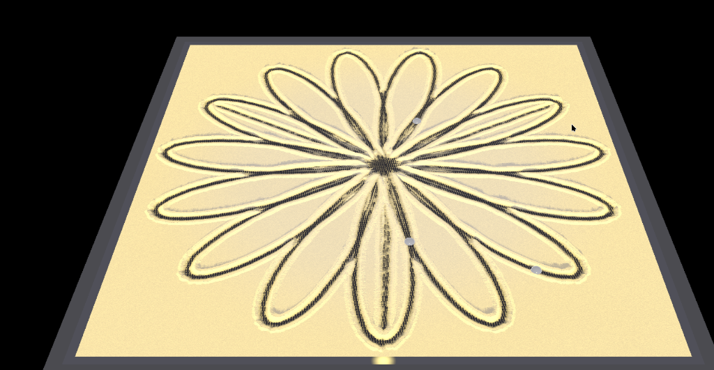

# Sands of Time: Kinetic Sand Art Simulator

A beautiful, high-performance simulation of a kinetic sand art table (like the Sisyphus table) written in Rust. The application simulates a physical steel ball rolling through a sand bed, carving intricate mathematical and path-based designs, illuminated by a dynamic RGB LED ring.

### 🌐 Live Web Sandbox
👉 **[tanaeem-moosa.github.io/sandart/](https://tanaeem-moosa.github.io/sandart/)**



## Project Goals

1. **Realistic Sand Physics & Displacement**:
   - **Heightmap Simulation**: Simulate the sand bed using a dynamic 2D heightmap.
   - **Displacement**: As the marble rolls, it pushes sand outward, creating realistic grooves and side ridges.
   - **Settle/Slide Effect**: Simulate gravity pulling sand back down if slopes exceed the natural angle of repose.
   
2. **Stunning Visuals & Lighting**:
   - **Height-Based Shading**: Real-time normal mapping of the sand surface to render realistic 32-step raymarched soft shadows, tactile normal sparkles, and ambient occlusion.
   - **Dynamic & Rotating RGB LED Ring**: An 8-LED ring that gently rotates around the perimeter, casting sweeping chromatic shadows (with dynamic 8-step raymarching per light) for a premium kinetic art table effect.
   - **Customizable Styles & Colors**: Integrated a real-time sand color picker widget, customizable LED brightness up to 3.0, and a toggle for soft raymarched shadows.

3. **Intricate Pattern Generation**:
   - **Mathematical Patterns**: Built-in generators for Spirographs, Lissajous curves, Rose curves, Trochoids, and Fourier-series-based art.
   - **Theta-Rho (`.thr`) File Support**: Support loading and playing standard `.thr` coordinate files widely used by physical kinetic sand tables.
   - **Interactive Drawing**: Drag the marble manually with the mouse/touchscreen to draw custom paths in real-time.

4. **Modern, Responsive User Interface**:
   - Built-in control panel to adjust ball speed, size, pattern parameters, color profiles, LED animations, and physics constants.
   - Cross-platform support (runs natively on Linux, Steam Deck, Windows, macOS, and potentially WebAssembly).

---

## Architecture & Tech Stack

- **Language**: Rust 🦀
- **Graphics & Rendering**: 
  - `wgpu` or `pixels` for hardware-accelerated GPU rendering.
  - Custom fragment shader for sand surface heightmap reconstruction, lighting (normal map generation), and LED ring ambient illumination.
- **User Interface**: `egui` (via `eframe`) for a clean, lightweight, immediate-mode GUI.
- **Physics**: Lightweight cellular automata or grid-based heightmap filters written in Rust (parallelized with `rayon` or run on the GPU via compute shaders).

---

## Getting Started

### Prerequisites

To compile and run this project, you need the Rust toolchain. Since the Steam Deck runs an immutable OS, we install and run everything inside **user space** without using `sudo`.

#### Installing Rust in User Space (Steam Deck / Immutable Linux)

You can easily install Rust locally using `rustup`, which installs entirely within your home directory (`~/.cargo` and `~/.rustup`).

1. Open a terminal and run the official `rustup` installer:
   ```bash
   curl --proto '=https' --tlsv1.2 -sSf https://sh.rustup.rs | sh -s -- -y
   ```
2. Configure your current shell session to include Cargo's binary directory on your `PATH`:
   ```bash
   source "$HOME/.cargo/env"
   ```
3. (Optional) To make this persistent, ensure your shell profile (e.g., `~/.bashrc` or `~/.zshrc`) loads the environment automatically. The installer usually appends this, but if not, you can manually add:
   ```bash
   export PATH="$HOME/.cargo/bin:$PATH"
   ```

#### Installing Required System Dependencies via Distrobox

Since the Steam Deck's root filesystem is read-only and standard system package modifications are wiped during SteamOS updates, we compile inside a **Distrobox** container named `sandart-dev` using an Arch Linux image. This container runs in user-space and has full access to developer libraries.

1. **Create the container**:
   ```bash
   distrobox create --name sandart-dev --image archlinux:latest
   ```
2. **Enter the container**:
   ```bash
   distrobox enter sandart-dev
   ```
3. **Install build tools and graphics development libraries (inside container)**:
   ```bash
   sudo pacman -Syu --noconfirm base-devel pkgconf mesa libx11 libxrandr libxi libxcursor wayland libxkbcommon libxkbcommon-x11
   ```
4. **Install or load Rust (inside container)**:
   ```bash
   # If Rust was not already installed:
   curl --proto '=https' --tlsv1.2 -sSf https://sh.rustup.rs | sh -s -- -y
   
   # Load cargo onto the path:
   source "$HOME/.cargo/env"
   ```

To compile or run the application from the host command line, you can execute:
```bash
distrobox enter sandart-dev -- /home/deck/.cargo/bin/cargo run --release
```

Once compiled, you can copy the binary from `target/release/sandart` directly to your `$HOME/.local/bin/` directory to run it natively on the Steam Deck host outside of Distrobox.

---

## Development Roadmap

The project is built in incremental, testable blocks:

- [x] **Block 1: Basic Scaffolding & Windowing**: Set up the `egui` layout, menus, panel widgets, and a placeholder canvas.
- [x] **Block 2: WGPU Render Pipeline Hook**: Integrate `egui_wgpu` with custom paint callbacks.
- [x] **Block 3: Heightmap Texture & CPU Buffer Transfer**: Create a float grid on the CPU. Map it to a dynamic WGPU texture.
- [x] **Block 4: Coordinate Mapping & Path Drawing**: Map GUI coordinate space to heightmap coordinate space and draw trails.
- [x] **Block 5A: Marble Path Interpolation & Volume-conserving Displacement**: Prevent "dotted line" trails and conserve volume.
- [x] **Block 5B: CPU Heightmap Settling (Cellular Automata)**: Implement gravity settling using local slopes.
- [x] **Refactoring Block: Codebase Restructuring & Health Prep**: Decouple the codebase into modular, single-responsibility files.
- [x] **Block 5C & 6: Playback & Trajectory Patterns (Spirals, G-code, Theta-Rho)**: Implement trajectory generators and G-code/Theta-Rho file parsers.
- [x] **Block 7: GPU 3D Normal Shading & Raymarched Shadows**: Update shader to calculate surface normals and render 3D Phong shadows.
- [x] **Block 8: Advanced Visuals & Physics Customization**: Integrate granular noise, rotating LED ring, and marble drift.
- [x] **v1.2: 3D Perspective Camera & Mesh**: Mesh generation, depth buffer configuration, orbit/zoom camera controller, shift-drag raycast drawing, and safe PRNG hashing.
- [x] **v1.3: Journey-Style Shading & Performance**: Zero-allocation raw float heightmap upload using `R32Float` with `Nearest` sampling, manual bilinear filtering in WGSL to support all hardware platforms, Half-Lambert diffuse wrapping, Fresnel rim lighting, coordinate-locked microfacet sparkles, and dynamic marble shadow offsets.
- [x] **v1.4: Pattern Generators (Step 4)**: Implement mathematical formulas for Lissajous, Rose curves, Spirograph, Fermat spirals, and Multi-marble paths supporting up to 5 marbles with Chase/Multi-Marble modes.
- [x] **v1.5: Material Physics Presets (Step 5)**: Implement 9 physical material presets (Butter-Cream, Dry Sand, Snow, Kinetic Sand, Wet Sand, Fine Powder, Oobleck, Moon Dust, and Iron Filings) across the cellular automata engine, app simulation controller, and the WGSL fragment shading system with perfect volume conservation.
- [x] **v1.5+: Space-Filling Curves & Stable Physics (Step 6)**:
  - Added **Gosper Curve** (hexagonal) and **Sierpinski Curve** (arrowhead/triangular) space-filling patterns.
  - Implemented **Magnetic Pull** for Iron Filings, causing filings to be stochastically attracted toward any active marble/magnet (including uphill flow).
  - Added a **Glass Cover Limit** (`1.5`) in `displace_line` that caps sand height and dynamically distributes excess volume to neighboring cells.
  - Fixed the gravity-avalanche collapse flow rate to a stable `0.10` and added dynamic conservation clamps to prevent numerical blowups.

---

## License & Disclaimers

### Disclaimer
This is not an officially supported Google product. 

This repository is a personal project authored by an employee of Google LLC. The views, code, and implementation details do not represent Google LLC or its affiliate companies.

### Vibe Coding
This project was built using "vibe coding" — designed, refactored, and implemented in partnership with agentic AI coding assistants.

### License
Copyright 2026 Google LLC

Licensed under the Apache License, Version 2.0 (the "License"); you may not use this file except in compliance with the License. You may obtain a copy of the License at

    http://www.apache.org/licenses/LICENSE-2.0

Unless required by applicable law or agreed to in writing, software distributed under the License is distributed on an "AS IS" BASIS, WITHOUT WARRANTIES OR CONDITIONS OF ANY KIND, either express or implied. See the License for the specific language governing permissions and limitations under the License.
