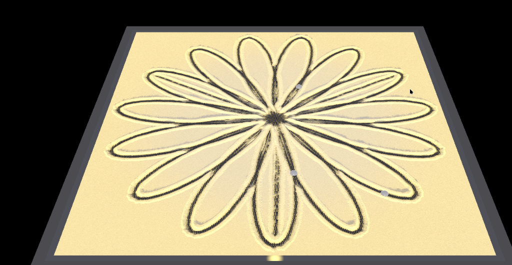

# Shoal & Swell: a sand and water simulator

A beautiful, high-performance simulation of a kinetic sand art table (like the Sisyphus table), written in Rust, that has grown a second identity: a gravity-driven granular/liquid flow sandbox (hourglasses, funnels, Galton boards, pourable water and sand) sharing the same engine. The original mode simulates a physical steel ball rolling through a sand bed, carving intricate mathematical and path-based designs, illuminated by a dynamic RGB LED ring; the newer "Sand-fall" mode simulates material falling and settling under directional gravity inside a chosen container shape.

**For how the codebase is put together — crate responsibilities, the physics model, and the invariants that have burned people before — see [`docs/ARCHITECTURE.md`](docs/ARCHITECTURE.md). Read it before making non-trivial changes to `sandart-sim` or `sandart-render`.**

### 🌐 Live Web Sandbox
👉 **[tanaeem-moosa.github.io/sandart/](https://tanaeem-moosa.github.io/sandart/)**

This WebAssembly build (`sandart-wasm`, auto-deployed from `main` — see `docs/ARCHITECTURE.md` §2 and §10) is the **only** surface the project is actually tested against. The native desktop app below shares the same simulation and rendering crates but is not part of that testing loop.



## Project Goals

1. **Realistic Sand & Liquid Physics**:
   - **Heightmap Simulation**: A dynamic 2D heightmap, settled by a conservative per-edge flux solver (see `docs/ARCHITECTURE.md` §4) rather than an unconstrained cellular automaton.
   - **Marble Displacement Mode**: As the marble rolls, it pushes sand outward, creating realistic grooves and side ridges, with gravity pulling sand back down past its angle of repose.
   - **Sand-fall Mode**: Directional gravity, pourable materials (sand and liquid presets), and a library of container shapes — Hourglass, MultiStageHourglass, GaltonBoard, StaircaseCascade, ProceduralFunnel, MultiNeckHourglass (funnel-style) plus Circle/Square/Oval (flat bed style), switching solver behavior automatically per shape.
   - **Per-Cell Material Properties**: Wetness, threshold, flow rate, and grain size are conserved, advected scalars per cell, not a single global material — a cell of wet sand and a cell of dry sand can sit side by side and mix physically as material flows between them.

2. **Stunning Visuals & Lighting**:
   - **Height-Based Shading**: Real-time normal mapping of the sand surface to render realistic 32-step raymarched soft shadows, tactile normal sparkles, and ambient occlusion.
   - **Dynamic & Rotating RGB LED Ring**: An 8-LED ring that gently rotates around the perimeter, casting sweeping chromatic shadows (with dynamic 8-step raymarching per light) for a premium kinetic art table effect.
   - **Customizable Styles & Colors**: Integrated a real-time sand color picker widget, customizable LED brightness up to 3.0, and a toggle for soft raymarched shadows.

3. **Intricate Pattern Generation**:
   - **Mathematical Patterns**: Built-in generators for Spirographs, Lissajous curves, Rose curves, Trochoids, Gosper/Sierpinski space-filling curves, and Fourier-series-based art.
   - **Theta-Rho (`.thr`) File Support**: Support loading and playing standard `.thr` coordinate files widely used by physical kinetic sand tables.
   - **Interactive Drawing**: Drag the marble manually with the mouse/touchscreen to draw custom paths in real-time.

4. **Modern, Responsive User Interface**:
   - Built-in control panel to adjust ball speed, size, pattern parameters, color profiles, LED animations, and physics constants.
   - Runs natively on Linux, Steam Deck, Windows, and macOS (`sandart` desktop app), and in-browser via WebAssembly (`sandart-wasm`) — see the live sandbox link above.

---

## Architecture & Tech Stack

- **Language**: Rust 🦀
- **Workspace**: five crates — `sandart-sim` (physics/state), `sandart-render` (WGPU pipeline + shader), `sandart-pattern` (marble path generators), `sandart-wasm` (browser front end), `sandart` (desktop front end). See `docs/ARCHITECTURE.md` §1 for the full breakdown and crate boundaries.
- **Graphics & Rendering**: `wgpu`, with a custom fragment/vertex shader (`sandart-render/src/shader.wgsl`) for heightmap surface reconstruction, lighting, and LED ring illumination.
- **User Interface**: `egui`/`eframe` for the native desktop app; a hand-written HTML/JS page (`sandart-wasm/web/`) for the browser build.
- **Physics**: a conservative per-edge flux solver for gravity/liquid flow, alongside the original displacement-based cellular automaton for marble carving — both in `sandart-sim/src/physics.rs`. See `docs/ARCHITECTURE.md` §4 onward for the model, its invariants, and its current known gaps.

---

## Getting Started

### Prerequisites

To compile and run this project, you need the Rust toolchain. Since the Steam Deck runs an immutable OS, we install and run everything inside **user space** without using `sudo`.

#### Installing Rust in User Space (Steam Deck / Immutable Linux)

You can easily install Rust locally using `rustup`, which installs entirely within your home directory (`~/.cargo` and `~/.rustup`).

1. Open a terminal and run the official `rustup` installer:
   ```bash
   curl --proto '=https' --tlsv1.2 -sSf https://sh.rustup.rs | sh -s -- -y
   ```
2. Configure your current shell session to include Cargo's binary directory on your `PATH`:
   ```bash
   source "$HOME/.cargo/env"
   ```
3. (Optional) To make this persistent, ensure your shell profile (e.g., `~/.bashrc` or `~/.zshrc`) loads the environment automatically. The installer usually appends this, but if not, you can manually add:
   ```bash
   export PATH="$HOME/.cargo/bin:$PATH"
   ```

#### Installing Required System Dependencies via Distrobox

Since the Steam Deck's root filesystem is read-only and standard system package modifications are wiped during SteamOS updates, we compile inside a **Distrobox** container named `sandart-dev` using an Arch Linux image. This container runs in user-space and has full access to developer libraries.

1. **Create the container**:
   ```bash
   distrobox create --name sandart-dev --image archlinux:latest
   ```
2. **Enter the container**:
   ```bash
   distrobox enter sandart-dev
   ```
3. **Install build tools and graphics development libraries (inside container)**:
   ```bash
   sudo pacman -Syu --noconfirm base-devel pkgconf mesa libx11 libxrandr libxi libxcursor wayland libxkbcommon libxkbcommon-x11
   ```
4. **Install or load Rust (inside container)**:
   ```bash
   # If Rust was not already installed:
   curl --proto '=https' --tlsv1.2 -sSf https://sh.rustup.rs | sh -s -- -y
   
   # Load cargo onto the path:
   source "$HOME/.cargo/env"
   ```

To compile or run the application from the host command line, you can execute:
```bash
distrobox enter sandart-dev -- /home/deck/.cargo/bin/cargo run --release
```

Once compiled, you can copy the binary from `target/release/sandart` directly to your `$HOME/.local/bin/` directory to run it natively on the Steam Deck host outside of Distrobox.

---

## Development Roadmap

The project is built in incremental, testable blocks:

> This log is historical and stops at v1.5+ (June 2026), before the crate split (`sandart-sim`/`sandart-render`/`sandart-pattern`/`sandart-wasm`) and before Sand-fall mode, the liquid solver, and per-cell material properties existed — see `docs/ARCHITECTURE.md` for the current architecture and `docs/archive/v2_plan.md`, `docs/archive/vertical_design.md` and `docs/archive/design.md` for how those later phases were planned (each carries a status banner noting how it relates to what shipped). One item below is stale as a *feature*, not just as a changelog entry: **Iron Filings and its Magnetic Pull behaviour were removed** during the per-cell property advection redesign (see `docs/archive/design.md`) and are not in the current material list (`MaterialMode::ALL` in `sandart-sim/src/lib.rs`, 14 materials, none of them magnetic).

- [x] **Block 1: Basic Scaffolding & Windowing**: Set up the `egui` layout, menus, panel widgets, and a placeholder canvas.
- [x] **Block 2: WGPU Render Pipeline Hook**: Integrate `egui_wgpu` with custom paint callbacks.
- [x] **Block 3: Heightmap Texture & CPU Buffer Transfer**: Create a float grid on the CPU. Map it to a dynamic WGPU texture.
- [x] **Block 4: Coordinate Mapping & Path Drawing**: Map GUI coordinate space to heightmap coordinate space and draw trails.
- [x] **Block 5A: Marble Path Interpolation & Volume-conserving Displacement**: Prevent "dotted line" trails and conserve volume.
- [x] **Block 5B: CPU Heightmap Settling (Cellular Automata)**: Implement gravity settling using local slopes.
- [x] **Refactoring Block: Codebase Restructuring & Health Prep**: Decouple the codebase into modular, single-responsibility files.
- [x] **Block 5C & 6: Playback & Trajectory Patterns (Spirals, G-code, Theta-Rho)**: Implement trajectory generators and G-code/Theta-Rho file parsers.
- [x] **Block 7: GPU 3D Normal Shading & Raymarched Shadows**: Update shader to calculate surface normals and render 3D Phong shadows.
- [x] **Block 8: Advanced Visuals & Physics Customization**: Integrate granular noise, rotating LED ring, and marble drift.
- [x] **v1.2: 3D Perspective Camera & Mesh**: Mesh generation, depth buffer configuration, orbit/zoom camera controller, shift-drag raycast drawing, and safe PRNG hashing.
- [x] **v1.3: Journey-Style Shading & Performance**: Zero-allocation raw float heightmap upload using `R32Float` with `Nearest` sampling, manual bilinear filtering in WGSL to support all hardware platforms, Half-Lambert diffuse wrapping, Fresnel rim lighting, coordinate-locked microfacet sparkles, and dynamic marble shadow offsets.
- [x] **v1.4: Pattern Generators (Step 4)**: Implement mathematical formulas for Lissajous, Rose curves, Spirograph, Fermat spirals, and Multi-marble paths supporting up to 5 marbles with Chase/Multi-Marble modes.
- [x] **v1.5: Material Physics Presets (Step 5)**: Implement 9 physical material presets (Butter-Cream, Dry Sand, Snow, Kinetic Sand, Wet Sand, Fine Powder, Oobleck, Moon Dust, and Iron Filings) across the cellular automata engine, app simulation controller, and the WGSL fragment shading system with perfect volume conservation.
- [x] **v1.5+: Space-Filling Curves & Stable Physics (Step 6)**:
  - Added **Gosper Curve** (hexagonal) and **Sierpinski Curve** (arrowhead/triangular) space-filling patterns.
  - Implemented **Magnetic Pull** for Iron Filings, causing filings to be stochastically attracted toward any active marble/magnet (including uphill flow).
  - Added a **Glass Cover Limit** (`1.5`) in `displace_line` that caps sand height and dynamically distributes excess volume to neighboring cells.
  - Fixed the gravity-avalanche collapse flow rate to a stable `0.10` and added dynamic conservation clamps to prevent numerical blowups.

---

## Project notes, backlog and handover

Design docs, the full ticket backlog and handovers written for whoever picks this up next live in
[`artifacts/`](artifacts/).

**Start with [`CLAUDE.md`](CLAUDE.md).** It is the authority on the build/test loop (there is no
linker on the dev host; everything compiles inside `distrobox enter sandart-dev`), the current test
state, and the one test that is *meant* to fail.

[`artifacts/HANDOVER.md`](artifacts/HANDOVER.md) is a **historical** document as of 2026-08-31 —
the overfill model, the hierarchical coarse level and the block-clock scheduler it describes were
deleted on 2026-08-30. It is kept for its record of what was tried and why it failed, which is the
part that cannot be recovered from the code. See
[`artifacts/design/SESSION-HANDOVER-2026-08-30.md`](artifacts/design/SESSION-HANDOVER-2026-08-30.md)
for that decision and the bisect behind it.

## License & Disclaimers

### Disclaimer
This is not an officially supported Google product. 

This repository is a personal project authored by an employee of Google LLC. The views, code, and implementation details do not represent Google LLC or its affiliate companies.

### Vibe Coding
This project was built using "vibe coding" — designed, refactored, and implemented in partnership with agentic AI coding assistants.

### License
Copyright 2026 Google LLC

Licensed under the Apache License, Version 2.0 (the "License"); you may not use this file except in compliance with the License. You may obtain a copy of the License at

    http://www.apache.org/licenses/LICENSE-2.0

Unless required by applicable law or agreed to in writing, software distributed under the License is distributed on an "AS IS" BASIS, WITHOUT WARRANTIES OR CONDITIONS OF ANY KIND, either express or implied. See the License for the specific language governing permissions and limitations under the License.
