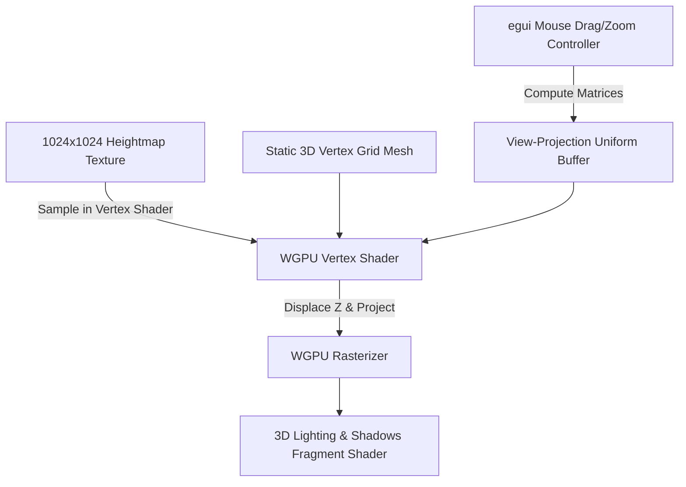

# Sand Art Simulator: Version 1 Architectural & Research Plan

This document outlines the technical research, feasibility analysis, and implementation strategy for migrating the Sand Art Simulator from the v0 2.5D rendering pipeline to a fully interactive 3D camera model with hyper-realistic sand rendering.

---

## 1. Goal 1: Interactive 3D Perspective Camera (Orbit/Zoom)

### Technical Feasibility: **Highly Feasible (Medium Complexity)**
Making the simulation "actually 3D" requires replacing the flat fullscreen orthographic projection with a perspective projection matrix and a user-controlled camera.

### Proposed Implementation Strategy

We propose a **Vertex-Displaced 3D Grid Mesh** approach. Rather than rendering a flat fullscreen quad and doing 2.5D shading in the fragment shader, we will render a true 3D surface:



#### A. WGPU Mesh Scaffolding (`src/renderer.rs`)
* Create a static vertex buffer representing a flat grid mesh (e.g. $256 \times 256$ or $512 \times 512$ vertices) inside the circular boundary.
* Each vertex will have a UV coordinate and a flat position $(x, y, 0)$.
* An index buffer will connect them into triangle strips.

#### B. Vertex Shader Displacement (`src/shader.wgsl`)
* Sample the heightmap texture inside the vertex shader using the vertex's UV coordinates.
* Displace the vertex's Z coordinate (height) proportionally to the sampled value:
  $$P_{world} = (x, y, h(u, v) \times \text{amplitude})$$
* Transform the displaced vertex position by the View-Projection Matrix:
  $$P_{clip} = \text{ViewProjectionMatrix} \times P_{world}$$

#### C. GUI Camera Controller (`src/app.rs`)
* Add orbit angles (azimuth $\theta$, elevation $\phi$) and distance (zoom $d$) fields to the configuration.
* Capture drag delta events on the egui canvas using `response.drag_delta()` to update $\theta$ and $\phi$.
* Capture scroll events to update zoom distance $d$.
* Compute a perspective camera View-Projection matrix using `glam::Mat4::look_at_lh` and `glam::Mat4::perspective_lh`.
* Write the camera matrices to a new uniform buffer binding in WGPU.

---

## 2. Goal 2: Hyper-Realistic Sand Shading

### Technical Feasibility: **Highly Feasible (Low-Medium Complexity)**
To make the sand look tactile, grainy, and organic like real sand, we can integrate rendering tricks inspired by modern technical art (e.g. *Journey* sand rendering, microfacet theory, and subsurface scattering).

### Research Sources
* **Alan Zucconi — "A Journey Into Journey's Sand Shader"** (6-part series): https://alanzucconi.com/2019/10/08/journey-sand-shader-1/
  Covers diffuse color, sand normals, specular reflection, glitter reflection, and sand ripples. Confirms that the sparkle effect is based on **Microfacet Theory** — treating the sand surface as a collection of randomly-oriented microscopic mirrors.
* **Microfacet Key Insight**: Standard normal maps cannot generate specular intensity > 1, which is required to trigger bloom. The glitter shader must produce HDR values by using a separate high-frequency noise-perturbed normal pass.
* **Journey used 3 heightmap layers**: base terrain, tiny ripples (wind/trail detail), and larger sand waves.

### Proposed Rendering Techniques

```
                                Light Source
                                     |
                                     v
                        .------------------------.
                       /  Specular/Shimmer Light  \
                      /   (Microfacet Glints)      \
                     /                               \
                    v                                 v
          +-------------------+             +--------------------+
          |  Half-Lambert     |             |  Fresnel/Rim Glow  |
          |  Diffuse Shading  |             |  (Internal Grain   |
          |  (Soft Light      |             |   Scattering)      |
          |   Absorption)     |             |                    |
          +-------------------+             +--------------------+
```

#### A. Microfacet Sparkle / Shimmer (twinkling highlights)
Real sand consists of tiny silica crystal facets that reflect bright light when aligned perfectly with the eye and light source.
* **Half-Vector Specular**: Calculate the half-vector $\vec{H} = \text{normalize}(\vec{L} + \vec{V})$ in the fragment shader.
* **Grain Specular Perturbation**: Generate a high-frequency noise normal perturbation using a detail normal map or coordinate-based hash noise.
* **Pinpoint Sparkles**: Compute the dot product between the perturbed normal and the half-vector. Apply a high exponent and threshold it with a step function so only tiny, scattered pixels spark:
  $$\text{glint} = \text{smoothstep}(0.96, 1.0, \text{pow}(\max(\vec{N}_{perturbed} \cdot \vec{H}, 0.0), 128.0)) \times \text{brightness}$$
  As the camera rotates ($\vec{V}$ changes) or light rotates ($\vec{L}$ changes), these sparkles naturally blink on and off.

#### B. Subsurface Scattering Approximation (Half-Lambert)
Light penetrates slightly into sand grains, scattering internally. This softens shadows and prevents flat regions from looking like solid stone.
* **Half-Lambert Diffuse**: Smooth out the light falloff:
  $$\text{diffuse} = \text{pow}((\vec{N} \cdot \vec{L} \times 0.5 + 0.5), 2.0)$$
* **Fresnel Rim Light**: Add a warm golden rim light along the silhouettes of sand ridges facing away from the light source, representing scattered backlight:
  $$\text{rim} = \text{pow}(1.0 - \max(\vec{N} \cdot \vec{V}, 0.0), 3.0) \times \max(\vec{N} \cdot \vec{L}, 0.0)$$

#### C. Mipmap Detail Preservation
To prevent sand grain details from turning blurry at distance (due to GPU mipmap filtering), we will override the texture sampling level for normal calculations or sharpen the detail normal mapping, keeping the sand looking crisp and tactile.

---

## 3. Goal 3: Realistic Granular Sand Physics

### Technical Feasibility: **Highly Feasible (Medium Complexity)**

### Research Sources
* **CA Granular Simulation (bibliotekanauki.pl)**: Confirms stochastic Monte Carlo-style probabilities as the standard approach for modeling friction in 2D heightmap CA.
* **Block CA / Margolus Neighbourhood**: Many modern sand simulations use 2×2 block-based CA to avoid race conditions and improve GPU parallelism.
* **Angle of Repose**: Controlled by the ratio of horizontal to vertical movement rules. To get steeper stable piles, increase the threshold before a particle initiates a move.
* **Stick-Slip Dynamics**: Alternating between static (stuck) and kinetic (sliding) states is key to avoiding fluid-like continuous flow.

### Key Physics Techniques

#### A. Shear Hysteresis (Static vs. Kinetic Repose Angles)
In real granular media, a pile can stand at a steep angle (static angle of repose) before it suddenly collapses. Once collapsing, it continues sliding until it reaches a flatter angle (kinetic angle of repose).
* Maintain a state bit per cell tracking whether it is "active" (sliding) or "static" (locked).
  * Cell transitions to **active** only when slope exceeds static threshold $\theta_s \approx 0.08$.
  * Active cell continues sliding until slope drops below kinetic threshold $\theta_k \approx 0.04$.
  * This prevents continuous micro-creep (butter-cream settling) and allows steep ridges to stand rigidly.

#### B. Quantized Height Transfers (Discrete Grains)
Instead of dividing height differences by a floating-point alpha (e.g. `diff * 0.15`), which behaves like a viscous fluid, restrict height transfers to discrete packet sizes:
* Multiples of a minimum grain height $\delta z \approx 0.005$.
* Creates distinct terraced steps and natural grain boundaries rather than perfectly smooth, melted slopes.

#### C. Avalanche Momentum & Friction Jamming
* **Avalanche Momentum**: Carry a fraction of sliding velocity into neighboring cells so collapses sweep naturally into valleys.
* **Friction Jamming**: Cells with 3+ static neighbors resist flow — models force-chain lockup, allows overhangs near marble path.
